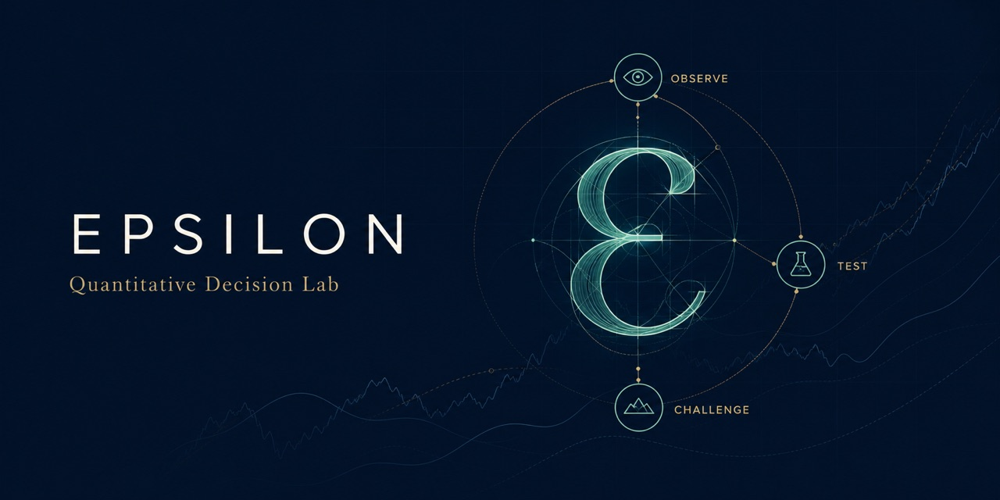
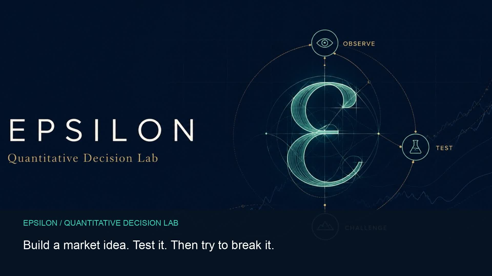
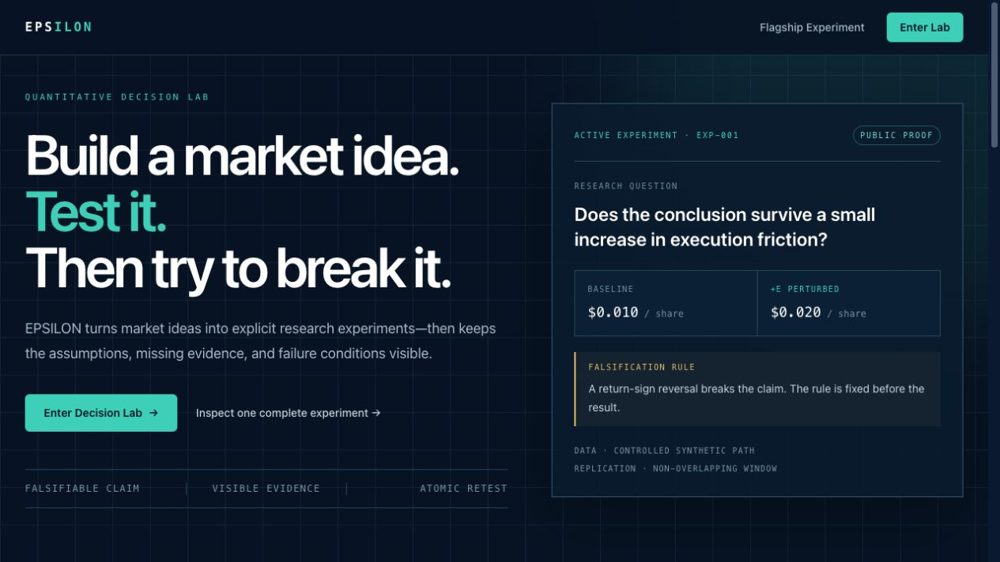
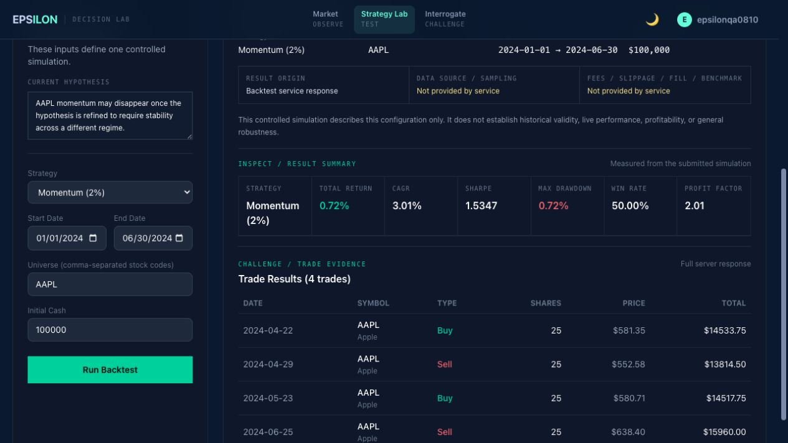

# EPSILON — Quantitative Decision Lab

<p align="center">
  <a href="https://epsilon-livid.vercel.app/landing">
    
  </a>
</p>

<p align="center">
  <a href="https://epsilon-livid.vercel.app/dashboard"><strong>Open Decision Lab</strong></a>
  &nbsp;·&nbsp;
  <a href="https://github.com/DresdenGman/EPSILON-trading-simulator/releases/download/v2.0.0/epsilon-decision-lab-30s.mp4"><strong>Watch the 30-second film</strong></a>
  &nbsp;·&nbsp;
  <a href="https://github.com/DresdenGman/EPSILON-trading-simulator/releases/tag/v2.0.0"><strong>Explore v2.0</strong></a>
</p>

> Build a market idea. Test it. Then try to break it.

I first built EPSILON as a trading simulator. I have since reworked it into a decision lab focused less on producing an answer than on testing how much that answer deserves to be trusted.

EPSILON is a research environment for turning market ideas into explicit, testable claims. It combines simulated market observation, strategy testing, evidence provenance, and structured critique in one repeatable decision cycle:

`Observe → Frame a hypothesis → Test → Interrogate → Refine → Retest`

EPSILON is not a trading recommendation engine. Its purpose is to make assumptions visible, preserve failed or negative evidence, and show exactly when a result no longer matches the question being asked.

## See the product

<p align="center">
  <a href="https://github.com/DresdenGman/EPSILON-trading-simulator/releases/download/v2.0.0/epsilon-decision-lab-30s.mp4">
    
  </a>
</p>

<p align="center"><em>Click the image to watch the 30-second product film.</em></p>

<table>
  <tr>
    <td width="50%">
      <a href="https://epsilon-livid.vercel.app/landing">
        
      </a>
    </td>
    <td width="50%">
      <a href="https://epsilon-livid.vercel.app/dashboard/backtest">
        
      </a>
    </td>
  </tr>
  <tr>
    <td align="center"><strong>One clear research path</strong><br><sub>Understand the idea and enter the workspace.</sub></td>
    <td align="center"><strong>Evidence stays attached</strong><br><sub>Inspect inputs, metrics, trades, and boundaries together.</sub></td>
  </tr>
</table>

## Start here

| Surface | Purpose |
|---|---|
| `/landing` | Understand what EPSILON is and why it exists |
| `/dashboard` | Enter the research product: Market → Strategy Lab → Interrogate |
| `/dashboard/backtest` | Test a claim and inspect its evidence boundary |
| `/dashboard/ai` | Interrogate the current result and refine the question |
| `/download` | Review source and desktop distribution status |

Retired presentation and legacy URLs remain compatible without creating competing products: `/demo` redirects to `/dashboard/backtest`, `/simulator` redirects to `/dashboard`, and `/video` redirects to `/landing`.

## Public launch assets

The product is ready for a controlled public launch around one clear idea: **a market result is more useful when its assumptions and failure conditions remain visible.**

- [Public launch kit](docs/PUBLIC_LAUNCH_KIT.md) — approved positioning, channel sequence, and ready-to-adapt copy
- [GitHub social preview (1280 × 640)](website/public/social/epsilon-social-preview-v1.jpg)
- [EPSILON v2.0 release](https://github.com/DresdenGman/EPSILON-trading-simulator/releases/tag/v2.0.0) — release notes, product film, and downloadable media assets

The launch kit deliberately separates claims that are demonstrated by the product from aspirations that still need user evidence. It should be used for authentic feedback and early-adopter conversations, not performance marketing or investment claims.

## The research loop

### 1. Market — Observe

Choose a market subject, inspect the available state, and frame a hypothesis. A hypothesis is stored as a claim, never as an observation.

### 2. Strategy Lab — Test

Run a backtest or inspect the structure of a series. Submitted inputs, computed outputs, and evidence provenance are shown separately. Missing provider, sampling, fee, slippage, fill, or benchmark information remains `unknown`/`null`; the interface does not invent it.

### 3. Interrogate — Challenge

Ask a research critic to identify assumptions, regime risk, parameter sensitivity, alternative explanations, and missing evidence. Public guest sessions use a clearly labeled local heuristic with no live AI or web retrieval; configured deployments may use the server-side model integration. Neither mode is an advisor, and neither receives stale test artifacts.

### 4. Refine and retest

Changing the subject or hypothesis makes the previous successful result stale without deleting it. A failed retest cannot overwrite the last successful artifact. Only a successful retest matching the current experiment becomes current evidence.

## Integrated sensitivity validation

The working product includes a controlled validation protocol that asks:

> Does the conclusion remain unchanged when execution friction increases slightly?

It runs the same momentum configuration twice, changes only execution slippage, evaluates a pre-specified return-sign rule, and repeats the protocol on a non-overlapping window.

Here, ε simply denotes the small increase in slippage used to test whether the conclusion survives.

The experiment currently uses the deterministic controlled synthetic path `CSP-v1`. It tests experimental sensitivity; it is not historical market validation, statistical significance, evidence of profitability, or proof of predictive performance.

The protocol now lives inside the Dashboard as part of the research workflow rather than as a separate public demo. Read the supporting records:

- [Flagship experiment protocol](docs/FLAGSHIP_EXPERIMENT.md)
- [Evidence matrix](docs/EVIDENCE.md)
- [Reproducibility instructions](docs/REPRODUCIBILITY.md)
- [Product architecture](docs/PRODUCT_ARCHITECTURE.md)

## Evidence discipline

EPSILON distinguishes four kinds of information:

| Type | Meaning |
|---|---|
| Hypothesis | A user-authored claim to test |
| Submitted inputs | Configuration sent to a research service |
| Computed outputs | Metrics returned by that service |
| Provenance | What is known—and not known—about data and execution assumptions |

EPSILON does not convert a hypothesis into a fact, a metric into a forecast, or missing provenance into a plausible-sounding source.

## Architecture

```text
Public understanding        Research product

/landing ─────────────────→ /dashboard
                                │
                           Market / hypothesis
                                ↓
                         Strategy Lab / test
                                ↓
                         Interrogate / refine
                                ↓
                              Retest

Next.js 14 / React / TypeScript
              ↓ REST
FastAPI / Python research and simulation services
              ↓
SQLite or PostgreSQL for account-dependent workflows
```

The original Python desktop application remains in this repository as part of EPSILON's development history and source distribution. It is not a second public web product.

## Run locally

Prerequisites: Python 3.11+, Node.js 18+, and npm.

Start the API:

```bash
python3 -m venv backend/venv
backend/venv/bin/pip install -r backend/requirements.txt
backend/venv/bin/uvicorn backend.main:app --host 127.0.0.1 --port 8000
```

Start the website in another terminal:

```bash
cd website
NEXT_PUBLIC_API_URL=http://127.0.0.1:8000 npm run dev
```

Open [http://localhost:3000](http://localhost:3000). The root route converges on `/landing`.

Guest research surfaces can run without PostgreSQL. Authentication and saved-account workflows remain database-dependent.

## Verification

```bash
# Core Python evidence paths
backend/venv/bin/python -m unittest tests.test_stock_data_manager tests.test_demo_runtime -v

# Website type and behavior checks
cd website
npx tsc --noEmit
npx vitest run
```

The web tests cover the research context lifecycle, stale evidence handling, atomic retesting, AI evidence boundaries, route convergence, authenticated navigation, and distribution truthfulness.

## What EPSILON does not claim

- No real-money execution
- No personalized financial advice
- No guaranteed real-time or historical provider unless provenance explicitly supplies one
- No strategy profitability or general robustness claim
- No public installer when a verifiable package has not been published

## Repository continuity

This is the original EPSILON repository. The project is evolving in place so its history, Stars, issues, and earlier desktop/web versions remain intact.

## License

MIT © 2026 Dresden E. Goehner
