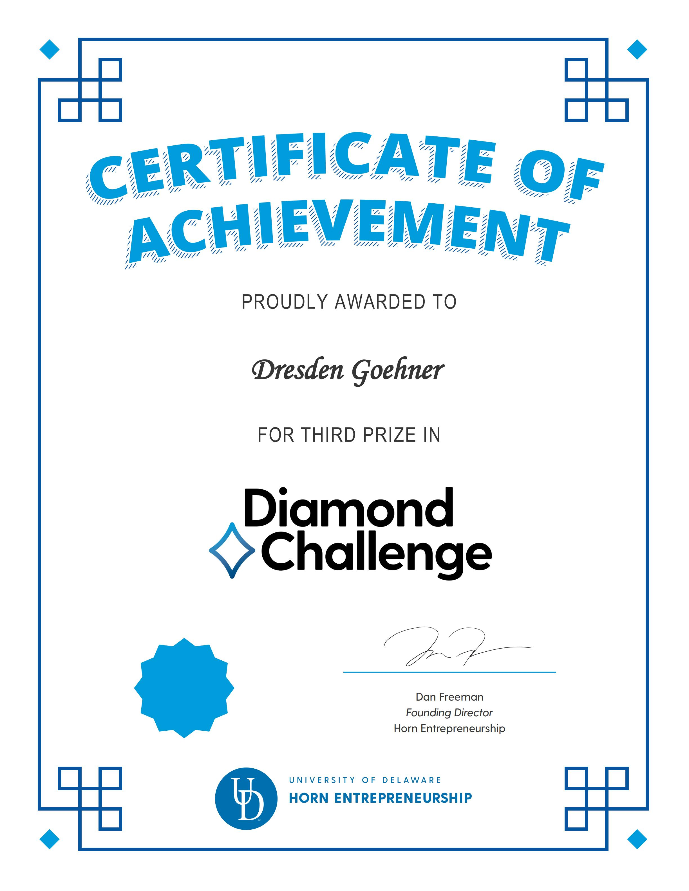

# Recognition

## Third Prize — 2026 Diamond Challenge Beijing Pitch Event

**Recipient printed on certificate:** Dresden Goehner.

**Project named in the organizer's email:** EPSILON.

**Award wording printed on certificate:** THIRD PRIZE in Diamond Challenge.

**Scope:** Beijing Pitch Event, regional recognition; not a global third-place claim.

[View the original certificate](../instrument/public/evidence/diamond-challenge-2026-beijing-third-prize.jpg)

### Provenance and timing

The organizer's email titled **Diamond Challenge 2026 Beijing Pitch Event – Certificate of Participation**, dated **March 13, 2026**, addresses Team EPSILON and attaches the award certificate. Event notices scheduled the online Beijing pitch for **March 7, 2026**. The certificate was inspected against the original attachment on September 18, 2026 and is reproduced unchanged.

The certificate image itself does **not** print a date or the word Beijing. Year, regional context, and email date come from the accompanying organizer correspondence, retained privately. Email addresses and unrelated correspondence are not published here. The generic email subject does not replace the **THIRD PRIZE** wording on the attached certificate.

This is recognition of the competition entry at that stage of development. It is not an endorsement of later software releases, an independently verified market result, or a guarantee of profitability. An invitation to apply for another program is not an appointment or additional award.
